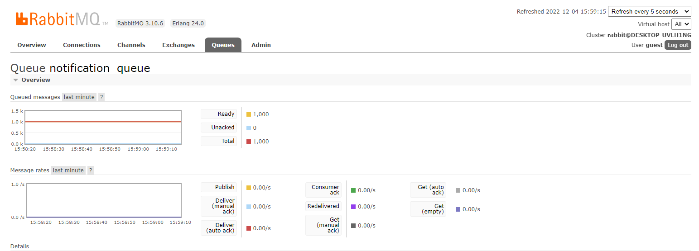
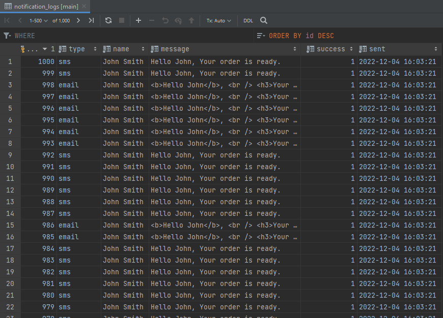
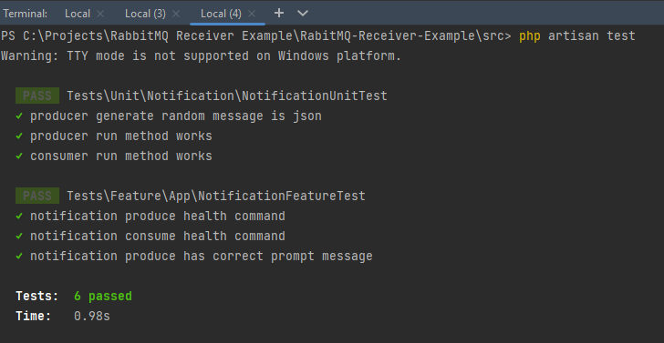

## Questioner

A simple Dockerized Laravel application, provided only 2 artisan commands to produce and consume messages with rabbitMQ
and a small automated testing as a sample for both black/white testing strategies

## Author

- name: Ali Jomehri
- phone: 09352770177
- mail: ajomehri@gmail.com

## What's included:

- PHP 8
- Production Readiness (Dockerized)
- No Eloquent, Doctrine used (pure mysql)
- No Laravel rabbitMQ packages used (like vyuldashev 's package), just pure php-amqplib used
- Strategy & Repository design patterns
- Using Laravel service container, binding of services & repositories
- Unit/Feature tests
- White Box testing for services without triggering real message delivery (mocking)
- Black Box feature tests to test the start/end point of services

## Installation:

- [install docker](https://docs.docker.com/get-docker/) based on your system environment
- cd project folder
- cd docker
- docker-compose up
- cd ../src
- cp .env.example .env
- cp .env.testing.example .env.testing
- composer install --ignore-platform-reqs
- **Grant required permissions:** sudo chmod 777 storage/ -R
- cd ../docker
- **Database Migrations(Raw mysql statements):** sudo docker-compose exec qst-php-web php artisan migrate:fresh
- **Test Database Migrations(Raw mysql statements):** sudo docker-compose exec qst-php-web php artisan migrate:fresh
  --env=testing
- **Workers:** open up one or a few consumer workers by this command in multiple terminals: sudo docker-compose exec
  qst-php-web php
  artisan
  rabbitmq:consume
- **Producer:** sudo docker-compose exec qst-php-web php artisan rabbitmq:produce (to produce 1000 messages which will
  be taken care
  of consumers)
- **To run the tests:** sudo docker-compose exec qst-php-web php artisan test

## Sample run screenshots

